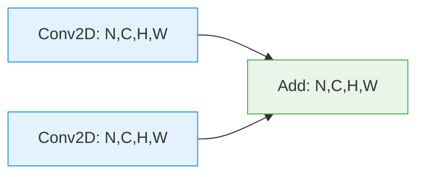
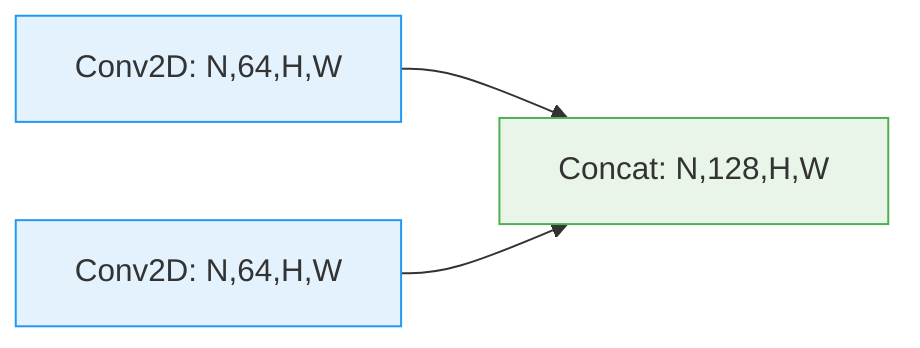
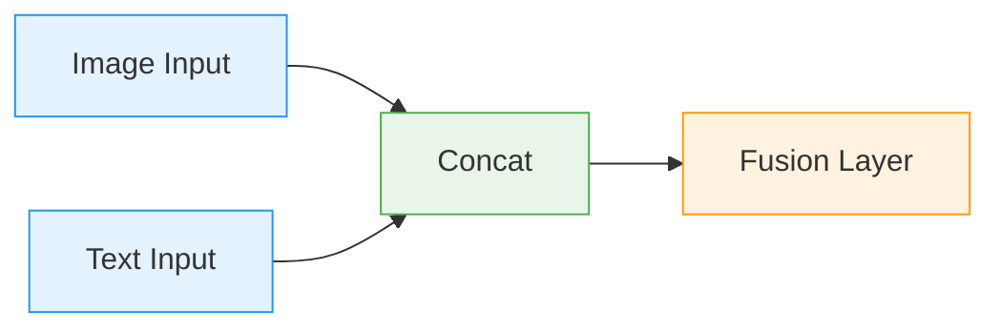
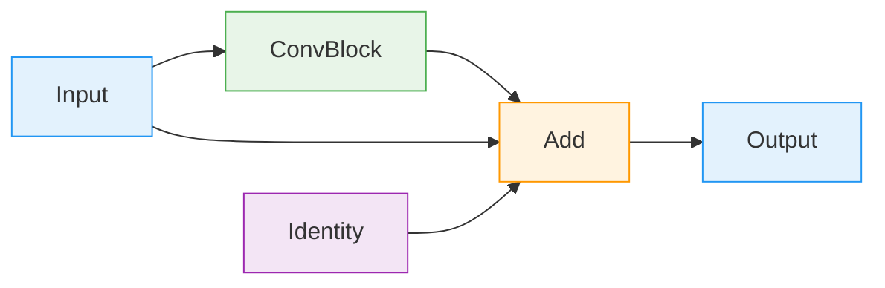
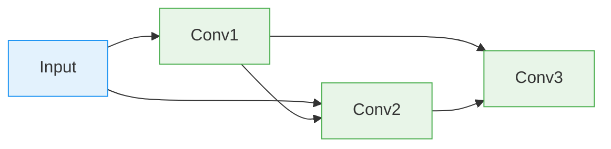
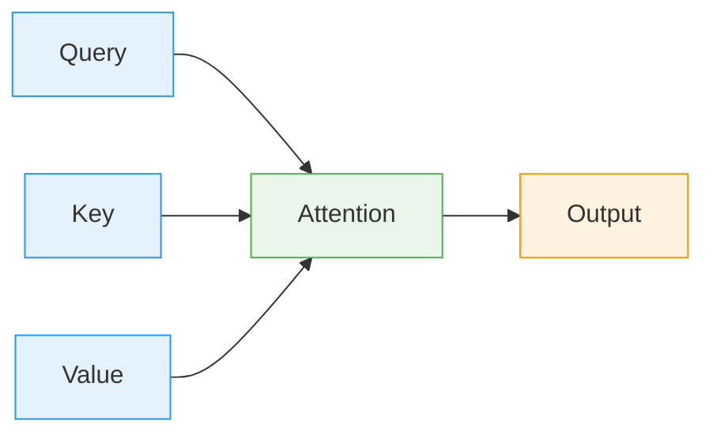

# Layer Connection Rules

Understanding which layers can connect to each other is crucial for building valid neural network architectures. This guide covers all connection rules and shape compatibility requirements.

## 🎯 Overview

VisionForge enforces strict connection rules to ensure architectural validity. Connections are validated based on:
- **Tensor shape compatibility**
- **Layer type constraints**
- **Framework-specific requirements**

## 📊 Tensor Dimension Notation

We use the following notation for tensor shapes:

| Dimension | Meaning | Example |
|-----------|---------|---------|
| **N** | Batch size | 32, 64, 1 |
| **C** | Channels | 3 (RGB), 64 (feature maps) |
| **H** | Height | 224, 512 |
| **W** | Width | 224, 512 |
| **D** | Depth | 16 (for 3D conv) |
| **L** | Sequence Length | 128, 256 |
| **F** | Features | 512, 1024 |

## 🔗 Core Connection Rules

### 1. Input Layer Rules

**Input → Convolutional**
```
Input: [N, C_in, H, W] → Conv2D: [N, C_out, H', W']
```
✅ **Valid**: Any 4D tensor
- `C_in` must match input channels
- `H, W` can be any size
- Output computed from kernel, stride, padding

**Input → Linear**
```
Input: [N, F_in] → Linear: [N, F_out]
```
✅ **Valid**: 2D tensor [batch, features]
❌ **Invalid**: 4D tensor (needs Flatten first)

**Input → LSTM/GRU**
```
Input: [N, L, F_in] → LSTM: [N, L, F_hidden]
```
✅ **Valid**: 3D sequence tensor
- `L` = sequence length
- `F_in` = input features

### 2. Convolutional Layer Rules

**Conv2D → Conv2D**
```
Conv2D: [N, C_in, H, W] → Conv2D: [N, C_out, H', W']
```
✅ **Valid**: Same number of dimensions
- `C_in` must match previous `C_out`
- Spatial dims can change based on kernel/stride

**Conv2D → Activation**
```
Conv2D: [N, C, H, W] → ReLU: [N, C, H, W]
```
✅ **Valid**: Element-wise operations preserve shape

**Conv2D → Pooling**
```
Conv2D: [N, C, H, W] → MaxPool2D: [N, C, H', W']
```
✅ **Valid**: Same channel count
- Spatial dims reduced by pooling

**Conv2D → Flatten**
```
Conv2D: [N, C, H, W] → Flatten: [N, C×H×W]
```
✅ **Valid**: Any 4D tensor
- Collapses all but batch dimension

### 3. Linear Layer Rules

**Linear → Linear**
```
Linear: [N, F_in] → Linear: [N, F_out]
```
✅ **Valid**: `F_in` must match previous `F_out`

**Linear → Activation**
```
Linear: [N, F] → ReLU: [N, F]
```
✅ **Valid**: Element-wise preserves shape

**Linear → Dropout**
```
Linear: [N, F] → Dropout: [N, F]
```
✅ **Valid**: Preserves shape during training

### 4. Recurrent Layer Rules

**LSTM → LSTM**
```
LSTM: [N, L, F_in] → LSTM: [N, L, F_out]
```
✅ **Valid**: Same sequence length
- `F_in` must match previous hidden size

**LSTM → Linear**
```
LSTM: [N, L, F] → Linear: [N, L, F_out]
```
✅ **Valid**: Apply to each time step
- Or use only last time step

**Embedding → LSTM**
```
Embedding: [N, L] → LSTM: [N, L, F_emb]
```
✅ **Valid**: Indices to dense vectors
- `F_emb` = embedding dimension

## 🔄 Merge Operation Rules

### Add Operation
**Requirements**:
- Same tensor shape
- Element-wise addition



✅ **Valid**: Same shape tensors
❌ **Invalid**: Different shapes or dimensions

### Concatenate Operation
**Requirements**:
- Same dimensions except concat axis
- Specified concat dimension



✅ **Valid**: Concat along channel dimension
✅ **Valid**: Concat along feature dimension
❌ **Invalid**: Different spatial dimensions

## 📋 Connection Validity Matrix

| From \ To | Input | Conv2D | Linear | LSTM | Add | Concat | Flatten |
|-----------|-------|--------|--------|------|-----|---------|---------|
| **Input** | ❌ | ✅ | ✅ | ✅ | ❌ | ❌ | ❌ |
| **Conv2D** | ❌ | ✅ | ❌ | ❌ | ✅ | ✅ | ✅ |
| **Linear** | ❌ | ❌ | ✅ | ❌ | ✅ | ✅ | ❌ |
| **LSTM** | ❌ | ❌ | ✅ | ✅ | ✅ | ✅ | ✅ |
| **Add** | ❌ | ✅ | ✅ | ✅ | ✅ | ✅ | ✅ |
| **Concat** | ❌ | ✅ | ✅ | ✅ | ✅ | ✅ | ✅ |
| **Flatten** | ❌ | ❌ | ✅ | ❌ | ✅ | ✅ | ❌ |

## 🚨 Common Connection Errors

### Shape Mismatch
```
❌ Conv2D([N,64,224,224]) → Linear([N,1000])
   Expected: [N, features], Got: [N,64,224,224]
```
**Solution**: Add Flatten layer before Linear

### Channel Mismatch
```
❌ Conv2D(out_channels=128) → Conv2D(in_channels=64)
   Expected: 128 channels, Got: 64 channels
```
**Solution**: Match input/output channels

### Dimension Mismatch
```
❌ LSTM([N,L,F]) → Conv2D([N,C,H,W])
   Expected: 4D tensor, Got: 3D tensor
```
**Solution**: Use appropriate layer types

### Sequence Length Mismatch
```
❌ LSTM(seq_len=128) → LSTM(seq_len=256)
   Expected: 128, Got: 256
```
**Solution**: Match sequence lengths

## 🎯 Special Cases

### Multi-input Networks


### Skip Connections


### Residual Networks
- **Identity mapping**: Input shape must equal output shape
- **Projection shortcut**: Use 1x1 conv to match dimensions

## 🔧 Framework-Specific Rules

### PyTorch Specific
- **BatchNorm2D**: Expects [N, C, H, W]
- **Dropout**: Training/inference mode affects behavior
- **LayerNorm**: Normalizes across specified dimensions

### TensorFlow Specific
- **BatchNormalization**: Different default behavior
- **Dropout**: Rate parameter (0.0-1.0)
- **Conv2D**: Data format (NHWC vs NCHW)

## 📚 Advanced Connection Patterns

### Dense Connections (DenseNet)


### Multi-Head Attention


## ✅ Validation Checklist

Before finalizing your architecture:

- [ ] All connections are green (valid)
- [ ] Input shapes are correctly specified
- [ ] No circular dependencies
- [ ] All required parameters are configured
- [ ] Merge operations have compatible inputs
- [ ] Output layer matches task requirements
- [ ] No orphaned blocks (unless intentional)

## 🚀 Next Steps

Now that you understand connection rules:
1. Practice with [Simple CNN Example](../../examples/simple-cnn.md)
2. Learn about [Shape Inference](shape-inference.md)
3. Study [Advanced Architectures](../../examples/)

---

**Need help?** Check [Validation Errors Guide](../../troubleshooting/validation-errors.md)
