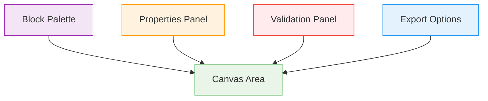
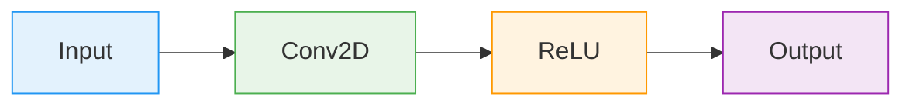
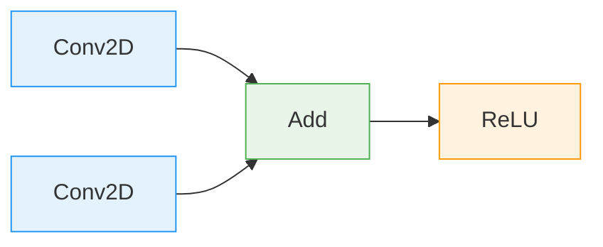
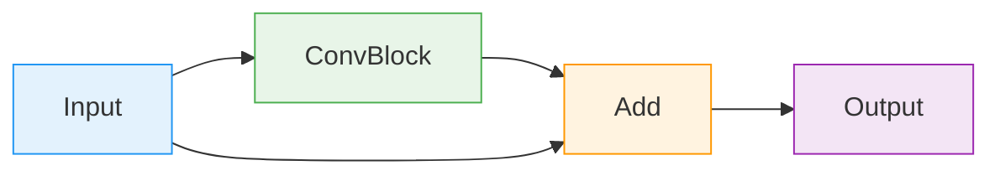

# Creating Architecture Diagrams

Learn how to build neural network architectures visually using VisionForge's drag-and-drop interface.

## 🎯 Overview

VisionForge provides a visual canvas where you can design neural networks by dragging and connecting layer blocks. The interface automatically handles tensor shape inference and validates connections in real-time.

## 🖥️ Interface Components



### 1. Block Palette (Left Sidebar)
Contains all available layers organized by category:
- **Input** - Data input layers
- **Basic** - Core neural network layers
- **Advanced** - Specialized operations
- **Merge** - Combining multiple paths
- **Output** - Loss and output layers

### 2. Canvas Area (Center)
The main workspace where you:
- Drag and drop blocks
- Create connections
- Arrange your architecture
- Visualize data flow

### 3. Properties Panel (Right)
Configure selected layer parameters:
- Layer-specific settings
- Shape information
- Validation status

### 4. Validation Panel (Bottom)
Real-time feedback on:
- Connection validity
- Shape compatibility
- Configuration errors

## 🎨 Building Your First Architecture

### Step 1: Add Input Layer
1. Open the **Input** category in the palette
2. Drag **Input** block to canvas
3. Configure input shape:
   ```json
   {
     "inputShape": {
       "dims": [1, 3, 224, 224]  // [batch, channels, height, width]
     }
   }
   ```

### Step 2: Add Core Layers
1. From **Basic** category, drag **Conv2D**
2. Position it to the right of input
3. Configure parameters:
   ```json
   {
     "out_channels": 64,
     "kernel_size": 3,
     "stride": 1,
     "padding": 1
   }
   ```

### Step 3: Create Connections
1. Hover over the output port of Input layer
2. Click and drag to the input port of Conv2D
3. Release to create connection
4. **Green line** = Valid connection
5. **Red line** = Invalid connection

### Step 4: Add Activation
1. Drag **ReLU** from **Basic** category
2. Connect Conv2D output to ReLU input
3. No configuration needed for basic activations

### Step 5: Complete the Network
Continue adding layers:
- **MaxPool2D** for downsampling
- **Flatten** for dimensionality reduction
- **Linear** for classification
- **Softmax** for output probabilities

## 🔗 Connection Types

### Standard Connections
Most layers have single input/output ports:


### Merge Operations
Some layers accept multiple inputs:


### Skip Connections
Create ResNet-style architectures:


## ⚙️ Advanced Features

### Group Blocks
Create reusable components:
1. Select multiple blocks
2. Right-click → "Create Group"
3. Define input/output ports
4. Save as custom block

### Copy/Paste
- **Ctrl+C** - Copy selected blocks
- **Ctrl+V** - Paste blocks
- Connections are preserved within copied blocks

### Undo/Redo
- **Ctrl+Z** - Undo last action
- **Ctrl+Y** - Redo action
- Full history maintained

### Canvas Navigation
- **Mouse wheel** - Zoom in/out
- **Click + drag** - Pan canvas
- **Double-click** - Fit to screen

## 🎯 Best Practices

### Organization
1. **Left to right flow** - Input on left, output on right
2. **Group related layers** - Use alignment guides
3. **Consistent spacing** - Leave room for connections
4. **Label important layers** - Use descriptive names

### Validation
1. **Watch connection colors** - Green = valid, red = invalid
2. **Check shape compatibility** - Hover over ports to see shapes
3. **Fix errors early** - Address validation warnings immediately
4. **Test incrementally** - Validate after each major addition

### Performance
1. **Minimize connections** - Avoid unnecessary complexity
2. **Use group blocks** - Reduce canvas clutter
3. **Optimize layout** - Reduce connection crossing

## 🔍 Real-time Feedback

### Shape Inference
VisionForge automatically computes tensor shapes:
```
Input: [1, 3, 224, 224]
  ↓ Conv2D(64, 3x3, stride=1, padding=1)
Conv2D: [1, 64, 224, 224]
  ↓ MaxPool2D(2x2, stride=2)
MaxPool: [1, 64, 112, 112]
  ↓ Flatten
Flatten: [1, 802,816]
```

### Validation Messages
- ✅ **Valid connections** - Green highlight
- ⚠️ **Warnings** - Yellow indicators (e.g., unused blocks)
- ❌ **Errors** - Red indicators (e.g., incompatible shapes)

### Tooltips
Hover over any element to see:
- Layer descriptions
- Shape information
- Connection details
- Configuration hints

## 🎨 Visual Customization

### Block Colors
Layers are color-coded by category:
- 🔵 **Input** - Blue
- 🟢 **Basic** - Green  
- 🟡 **Advanced** - Yellow
- 🟣 **Merge** - Purple
- 🔴 **Output** - Red

### Connection Styles
- **Solid line** - Standard connection
- **Dashed line** - Conditional connection
- **Thick line** - High-dimensional data flow

## 🚀 Next Steps

Now that you understand how to create diagrams:
1. Learn [Layer Connection Rules](connection-rules.md)
2. Study [Shape Inference](shape-inference.md)
3. Try [Example Architectures](../../examples/)
4. Export your first [PyTorch model](../../codegen/pytorch.md)

---

**Need help?** Check our [Troubleshooting Guide](../../troubleshooting/common-issues.md)
