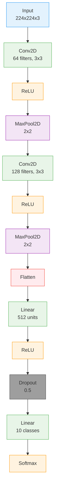

# Simple CNN Example

Build a complete image classification network from scratch using VisionForge's visual interface.

## 🎯 Overview

This tutorial walks you through creating a simple Convolutional Neural Network (CNN) for image classification. You'll learn:
- How to arrange layers properly
- Connection best practices
- Parameter configuration
- Exporting to PyTorch code

## 🏗️ Architecture Overview

We'll build this CNN architecture:



**Target Task**: 10-class image classification (e.g., CIFAR-10)
**Input Size**: 224×224×3 RGB images
**Output**: 10 class probabilities

## 📝 Step-by-Step Guide

### Step 1: Set Up Input Layer

1. **Add Input Block**
   - Drag **Input** from the **Input** category
   - Place it on the left side of the canvas

2. **Configure Input Shape**
   ```json
   {
     "inputShape": {
       "dims": [1, 3, 224, 224]
     }
   }
   ```
   - **Batch size**: 1 (can be changed later)
   - **Channels**: 3 (RGB)
   - **Height**: 224 pixels
   - **Width**: 224 pixels

### Step 2: First Convolutional Block

3. **Add Conv2D Layer**
   - Drag **Conv2D** from **Basic** category
   - Position it to the right of Input

4. **Configure Conv2D**
   ```json
   {
     "out_channels": 64,
     "kernel_size": 3,
     "stride": 1,
     "padding": 1
   }
   ```
   - **Output channels**: 64 feature maps
   - **Kernel size**: 3×3 convolution
   - **Stride**: 1 (no downsampling)
   - **Padding**: 1 (preserves spatial size)

5. **Add ReLU Activation**
   - Drag **ReLU** from **Basic** category
   - Connect Conv2D → ReLU

6. **Add MaxPool2D**
   - Drag **MaxPool2D** from **Pooling** category
   - Configure:
   ```json
   {
     "kernel_size": 2,
     "stride": 2
   }
   ```
   - Output shape: [1, 64, 112, 112]

### Step 3: Second Convolutional Block

7. **Add Second Conv2D**
   - Drag another **Conv2D**
   - Configure:
   ```json
   {
     "out_channels": 128,
     "kernel_size": 3,
     "stride": 1,
     "padding": 1
   }
   ```
   - Input: [1, 64, 112, 112]
   - Output: [1, 128, 112, 112]

8. **Add ReLU and MaxPool2D**
   - Add **ReLU** after Conv2D
   - Add **MaxPool2D** (2×2, stride=2)
   - Final shape: [1, 128, 56, 56]

### Step 4: Classification Head

9. **Add Flatten Layer**
   - Drag **Flatten** from **Basic** category
   - Input: [1, 128, 56, 56]
   - Output: [1, 401,408] (128 × 56 × 56)

10. **Add First Linear Layer**
    - Drag **Linear** from **Basic** category
    - Configure:
    ```json
    {
      "out_features": 512
    }
    ```
    - Input: [1, 401,408]
    - Output: [1, 512]

11. **Add ReLU and Dropout**
    - Add **ReLU** activation
    - Add **Dropout** with rate 0.5:
    ```json
    {
      "p": 0.5
    }
    ```

### Step 5: Output Layer

12. **Add Final Linear Layer**
    - Drag **Linear** layer
    - Configure:
    ```json
    {
      "out_features": 10
    }
    ```
    - Input: [1, 512]
    - Output: [1, 10] (logits)

13. **Add Softmax**
    - Drag **Softmax** from **Activation** category
    - Configure:
    ```json
    {
      "dim": 1
    }
    ```
    - Output: [1, 10] (probabilities)

## 🔗 Complete Connection Flow

Verify all connections are in order:

```
Input → Conv2D → ReLU → MaxPool2D → Conv2D → ReLU → MaxPool2D 
      → Flatten → Linear → ReLU → Dropout → Linear → Softmax
```

All connections should show **green** lines indicating valid connections.

## 📊 Shape Progression

Track how tensor shapes change through the network:

| Layer | Input Shape | Output Shape | Transformation |
|-------|-------------|--------------|----------------|
| Input | - | [1, 3, 224, 224] | User defined |
| Conv2D | [1, 3, 224, 224] | [1, 64, 224, 224] | 3→64 channels |
| ReLU | [1, 64, 224, 224] | [1, 64, 224, 224] | Element-wise |
| MaxPool2D | [1, 64, 224, 224] | [1, 64, 112, 112] | 2×2 pooling |
| Conv2D | [1, 64, 112, 112] | [1, 128, 112, 112] | 64→128 channels |
| ReLU | [1, 128, 112, 112] | [1, 128, 112, 112] | Element-wise |
| MaxPool2D | [1, 128, 112, 112] | [1, 128, 56, 56] | 2×2 pooling |
| Flatten | [1, 128, 56, 56] | [1, 401,408] | Collapse spatial |
| Linear | [1, 401,408] | [1, 512] | Dense projection |
| ReLU | [1, 512] | [1, 512] | Element-wise |
| Dropout | [1, 512] | [1, 512] | Random zeroing |
| Linear | [1, 512] | [1, 10] | Classification |
| Softmax | [1, 10] | [1, 10] | Probabilities |

## ✅ Validation Checklist

Before exporting, verify:

- [ ] All connections are green
- [ ] Input shape is correctly specified
- [ ] No red validation errors
- [ ] Output matches task requirements (10 classes)
- [ ] All required parameters are configured

## 🚀 Export to PyTorch

1. **Open Export Panel**
   - Click the export button in the toolbar
   - Select **PyTorch** as framework

2. **Configure Export Options**
   ```json
   {
     "class_name": "SimpleCNN",
     "include_imports": true,
     "include_forward": true
   }
   ```

3. **Generated Code**
   ```python
   import torch
   import torch.nn as nn
   import torch.nn.functional as F

   class SimpleCNN(nn.Module):
       def __init__(self):
           super(SimpleCNN, self).__init__()
           
           # Convolutional layers
           self.conv1 = nn.Conv2d(3, 64, kernel_size=3, stride=1, padding=1)
           self.conv2 = nn.Conv2d(64, 128, kernel_size=3, stride=1, padding=1)
           
           # Pooling layer
           self.pool = nn.MaxPool2d(kernel_size=2, stride=2)
           
           # Fully connected layers
           self.fc1 = nn.Linear(128 * 56 * 56, 512)
           self.fc2 = nn.Linear(512, 10)
           
           # Dropout
           self.dropout = nn.Dropout(p=0.5)
       
       def forward(self, x):
           # First conv block
           x = self.pool(F.relu(self.conv1(x)))
           
           # Second conv block
           x = self.pool(F.relu(self.conv2(x)))
           
           # Flatten and classify
           x = x.view(x.size(0), -1)  # Flatten
           x = F.relu(self.fc1(x))
           x = self.dropout(x)
           x = self.fc2(x)
           
           return F.softmax(x, dim=1)
   ```

## 🎯 Usage Example

```python
# Create model instance
model = SimpleCNN()

# Test with sample input
sample_input = torch.randn(1, 3, 224, 224)
output = model(sample_input)

print(f"Output shape: {output.shape}")  # torch.Size([1, 10])
print(f"Probabilities: {output}")
```

## 🔧 Customization Ideas

### Different Architectures
- **More layers**: Add additional conv blocks
- **Different filters**: Try 32, 256, 512 channels
- **Different kernel sizes**: 5×5, 7×7 convolutions
- **BatchNorm**: Add BatchNorm2d after conv layers

### Advanced Features
- **Global Average Pooling**: Replace Flatten+Linear with GAP
- **Residual connections**: Add skip connections
- **Data augmentation**: Not in architecture, but important for training

## 📚 Related Examples

- [ResNet Architecture](resnet.md) - Skip connections
- [LSTM Networks](lstm.md) - Sequence modeling
- [Custom Group Blocks](group-blocks.md) - Reusable components

## 🚀 Next Steps

1. **Train the model** using your favorite framework
2. **Experiment with different architectures**
3. **Try transfer learning** with pretrained models
4. **Deploy to production** using the exported code

---

**Ready for more?** Try the [ResNet example](resnet.md) for advanced architectures!
