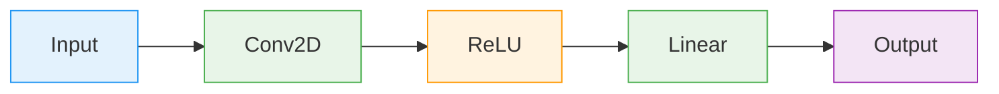
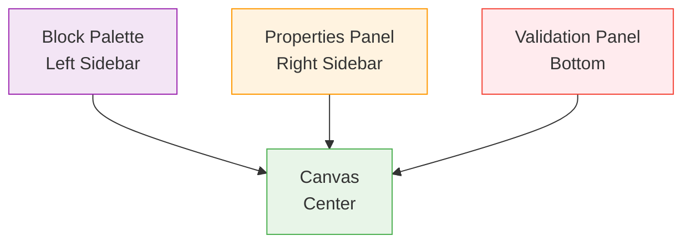

# Quick Start Guide

Build your first neural network in minutes with VisionForge's visual interface.

## 🎯 What You'll Build

In this guide, you'll create a simple image classification CNN:



## 🚀 Step 1: Launch VisionForge

1. **Start the backend server**
   ```bash
   cd visionforge/project
   python manage.py runserver
   ```

2. **Start the frontend server**
   ```bash
   cd visionforge/project/frontend
   npm run dev
   ```

3. **Open your browser**
   Navigate to `http://localhost:5173`

## 🖥️ Step 2: Explore the Interface

You'll see four main areas:



## 🎨 Step 3: Create Your First Network

### Add Input Layer

1. **Open Block Palette** (left sidebar)
2. **Click "Input"** category
3. **Drag "Input"** to the canvas
4. **Configure it**:
   - Click the Input block
   - In Properties panel, set:
   ```json
   {
     "inputShape": {
       "dims": [1, 3, 224, 224]
     }
   }
   ```

### Add Convolutional Layer

1. **Click "Basic"** category in palette
2. **Drag "Conv2D"** to the right of Input
3. **Connect them**:
   - Hover over Input's output port (right edge)
   - Click and drag to Conv2D's input port (left edge)
   - Release to create connection
4. **Configure Conv2D**:
   ```json
   {
     "out_channels": 32,
     "kernel_size": 3,
     "stride": 1,
     "padding": 1
   }
   ```

### Add Activation

1. **Drag "ReLU"** from Basic category
2. **Connect Conv2D → ReLU**
3. **No configuration needed** for ReLU

### Add Output Layer

1. **Drag "Linear"** from Basic category
2. **Connect ReLU → Linear**
3. **Configure Linear**:
   ```json
   {
     "out_features": 10
   }
   ```

## ✅ Step 4: Validate Your Architecture

### Check Connections

- **Green lines** = Valid connections ✅
- **Red lines** = Invalid connections ❌
- **Yellow indicators** = Warnings ⚠️

### Check Validation Panel

Look at the bottom panel for:
- ✅ **"Architecture is valid"** - You're ready to export!
- ❌ **Error messages** - Fix any issues before proceeding

## 🚀 Step 5: Export Your Model

1. **Click Export Button** (top toolbar)
2. **Select PyTorch** as framework
3. **Configure Export**:
   ```json
   {
     "class_name": "MyFirstModel",
     "include_imports": true
   }
   ```
4. **Click "Generate Code"**

### Generated Code

You'll see PyTorch code like this:

```python
import torch
import torch.nn as nn
import torch.nn.functional as F

class MyFirstModel(nn.Module):
    def __init__(self):
        super(MyFirstModel, self).__init__()
        self.conv1 = nn.Conv2d(3, 32, kernel_size=3, stride=1, padding=1)
        self.fc1 = nn.Linear(32 * 224 * 224, 10)
    
    def forward(self, x):
        x = F.relu(self.conv1(x))
        x = x.view(x.size(0), -1)  # Flatten
        x = self.fc1(x)
        return x
```

## 🎯 Step 6: Test Your Model

1. **Copy the generated code**
2. **Save it as `model.py`**
3. **Test it**:

```python
import torch
from model import MyFirstModel

# Create model
model = MyFirstModel()

# Test with sample input
sample = torch.randn(1, 3, 224, 224)
output = model(sample)

print(f"Input shape: {sample.shape}")
print(f"Output shape: {output.shape}")
```

## 🎉 Congratulations!

You've just:
- ✅ Created your first neural network visually
- ✅ Learned to connect layers properly
- ✅ Exported working PyTorch code
- ✅ Validated your architecture

## 🔧 What's Next?

### Try More Complex Architectures

1. **Add more layers**:
   - Add pooling layers for downsampling
   - Add multiple conv blocks
   - Add dropout for regularization

2. **Experiment with parameters**:
   - Change filter counts (16, 64, 128)
   - Try different kernel sizes (5×5, 7×7)
   - Adjust stride and padding

3. **Learn advanced features**:
   - Skip connections (ResNet style)
   - Merge operations (Add, Concat)
   - Group blocks (reusable components)

### Explore Examples

- [Simple CNN Tutorial](../examples/simple-cnn.md) - Complete walkthrough
- [ResNet Architecture](../examples/resnet.md) - Skip connections
- [LSTM Networks](../examples/lstm.md) - Sequence modeling

### Master the Interface

- [Interface Overview](interface.md) - Detailed feature guide
- [Connection Rules](../architecture/connection-rules.md) - Layer compatibility
- [Shape Inference](../architecture/shape-inference.md) - Understanding dimensions

## 🎯 Quick Tips

### Keyboard Shortcuts

| Shortcut | Action |
|----------|--------|
| `Ctrl+Z` | Undo |
| `Ctrl+Y` | Redo |
| `Delete` | Remove selected block |
| `Ctrl+C` | Copy blocks |
| `Ctrl+V` | Paste blocks |

### Best Practices

1. **Start simple** - Add layers incrementally
2. **Validate often** - Check connections after each addition
3. **Read tooltips** - Hover over elements for help
4. **Use the validation panel** - Fix errors early

### Common Patterns

**CNN Pattern**:
```
Input → Conv2D → ReLU → MaxPool2D → Conv2D → ReLU → Flatten → Linear
```

**Classification Pattern**:
```
Features → Linear → ReLU → Dropout → Linear → Softmax
```

## 🆘 Need Help?

**Stuck on something?**

1. **Check validation messages** - Bottom panel shows specific errors
2. **Hover over connections** - See shape information
3. **Consult the docs** - [Troubleshooting Guide](../troubleshooting/common-issues.md)
4. **Ask the AI assistant** - Built-in help in the interface

**Common Issues:**

- **Red connections**: Check [Layer Connection Rules](../architecture/connection-rules.md)
- **Shape errors**: Review [Shape Inference](../architecture/shape-inference.md)
- **Export issues**: Verify all parameters are configured

---

**Ready to dive deeper?** → [Architecture Design Guide](../architecture/creating-diagrams.md)
