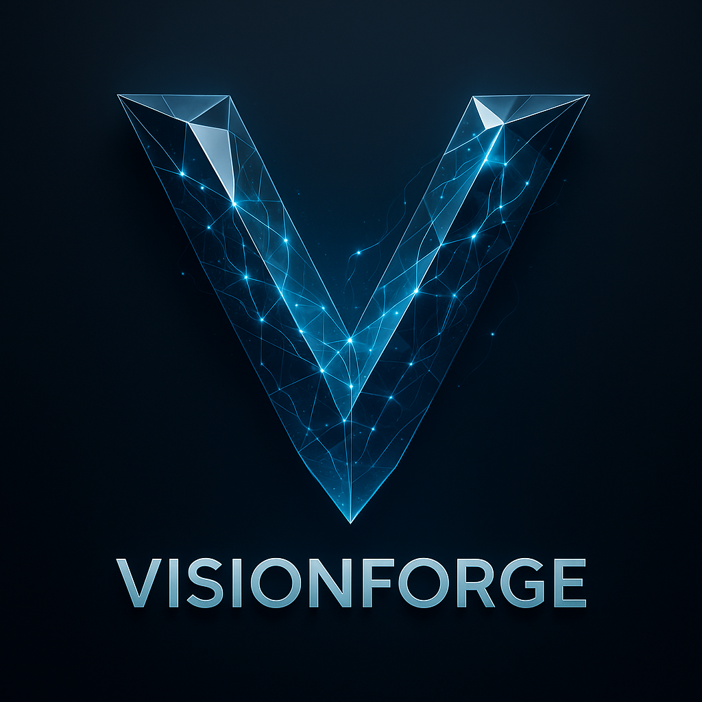
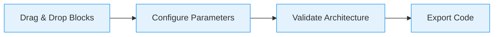

# VisionForge User Documentation

  

**Build Neural Networks Visually — Export Production Code**

VisionForge is a powerful visual neural network builder that lets you design complex deep learning architectures through an intuitive drag-and-drop interface. Perfect for researchers, students, and ML engineers who want to rapidly prototype models.

## ✨ Key Features

- 🎨 **Drag-and-drop interface** — Build CNNs, LSTMs, ResNets visually
- ⚡ **Automatic shape inference** — No manual tensor dimension tracking
- 🔄 **Multi-framework export** — PyTorch or TensorFlow with one click
- 🤖 **AI-powered assistant** — Ask questions or modify your model with natural language
- ✅ **Real-time validation** — Catch architecture errors before export
- 🎯 **Group blocks** — Create reusable custom components

## 🚀 Quick Start

1. **Install VisionForge** following our [Installation Guide](getting-started/installation.md)
2. **Launch the application** and open your browser to `http://localhost:5173`
3. **Create your first model** using our [Quick Start Guide](getting-started/quickstart.md)
4. **Learn architecture rules** in [Layer Connection Rules](architecture/connection-rules.md)

## 📖 Documentation Structure

### 🎯 For Beginners
- [Installation Guide](getting-started/installation.md) - Set up VisionForge on your system
- [Quick Start](getting-started/quickstart.md) - Build your first neural network
- [Interface Overview](getting-started/interface.md) - Understand the workspace

### 🏗️ Architecture Design
- [Creating Architecture Diagrams](architecture/creating-diagrams.md) - Learn visual model building
- [Layer Connection Rules](architecture/connection-rules.md) - Understand which layers connect
- [Shape Inference](architecture/shape-inference.md) - How tensor dimensions are computed
- [Validation System](architecture/validation.md) - Real-time error checking

### 📚 Layer Reference
- [Input Layers](layers/input.md) - Data input configurations
- [Core Layers](layers/core.md) - Convolutional, Linear, and basic operations
- [Activation Functions](layers/activation.md) - Non-linear transformations
- [Pooling Layers](layers/pooling.md) - Dimensionality reduction
- [Merge Operations](layers/merge.md) - Combining multiple paths
- [Advanced Layers](layers/advanced.md) - Specialized operations

### 💡 Examples & Tutorials
- [Simple CNN](examples/simple-cnn.md) - Basic image classification
- [ResNet Architecture](examples/resnet.md) - Skip connections
- [LSTM Networks](examples/lstm.md) - Sequence modeling
- [Custom Group Blocks](examples/group-blocks.md) - Reusable components

### 🔧 Advanced Topics
- [Group Blocks](advanced/group-blocks.md) - Create custom layer groups
- [AI Assistant](advanced/ai-assistant.md) - Natural language help
- [Project Sharing](advanced/sharing.md) - Collaborate with others

## 🎯 How It Works

1. **Add layers** from the sidebar palette
2. **Connect blocks** to define data flow
3. **Configure parameters** using the properties panel
4. **Validate** your architecture with real-time checks
5. **Export** production-ready code

## 🛠️ Supported Frameworks

| Framework | Status | Export Formats |
|-----------|--------|----------------|
| **PyTorch** | ✅ Full Support | `.py`, `.pt` |
| **TensorFlow** | ✅ Full Support | `.py`, SavedModel |
| **ONNX** | 🚧 Coming Soon | `.onnx` |

## 🎨 Architecture Categories

VisionForge supports various neural network architectures:

- **Convolutional Neural Networks (CNNs)** - Image classification, object detection
- **Recurrent Neural Networks (RNNs)** - Sequence modeling, time series
- **Transformer Networks** - Attention mechanisms, NLP
- **Custom Architectures** - Mix and match any layers
- **Group Blocks** - Create reusable components

## 🔗 External Resources

- [VisionForge GitHub Repository](https://github.com/devgunnu/visionforge)
- [PyTorch Documentation](https://pytorch.org/docs/)
- [TensorFlow Documentation](https://www.tensorflow.org/api_docs)
- [Deep Learning Book](https://www.deeplearningbook.org/)

---

**Ready to start building?** → [Quick Start Guide](getting-started/quickstart.md)
